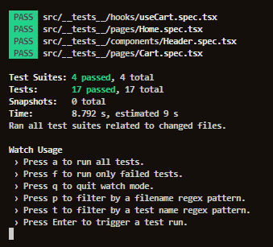

# Rocketshoes

Hello everybody! At this time I would like to show you a project that I've done with the ReactJS Course from **Rocketseat Ignite**.

Here you will find a shopping cart project. Basically We can

- Add products from the shopping cart
- Remove products from the shopping cart
- Verify the stock to increase and decrease the product's amount
- Update the products's amount

<br/>

### Home


### Cart


The tests evidence is shown below what makes sure that the application is working correctly and without bugs.

;

## Status

finished 🚀

## Concepts Applied

- context Hooks
- states Hooks
- Effects hooks
- localStorage Managing

## Requirements and How to use

If you want to access and study the code, follow the next steps:

To run this application locally you just need to install [node](https://nodejs.org/en/) in your computer. By doing that npm (node package manager) will be installed too. So know you can start the application by running:

```bash
# Install yarn in computer globally
npm install yarn --global

# Install all dependencies with yarn
yarn

# Start the application with yarn
yarn start

```

To run the `Tests`

```bash

yarn test

```

## Techonologies

- ReactJS (UI / Declarative Programming Framework)
- Styled Components (UI styles)
- Jest (tests)
- Yarn (Package manager)

### EDITOR

- [Visual Studio Code](https://code.visualstudio.com/)

---

## 💪 How to contribute to the project

1. **Fork** the project.

2. Create a new branch with your changes: `git checkout -b my-feature`

3. Save the changes and create a commit message telling what you did: `git commit -m "feature: My new feature"`

4. Push your changes: `git push origin my-feature`

> If you have any questions, check out this [guide on how to contribute on GitHub](./CONTRIBUTING.md)

## Author

<div>


<sub><b>Victor Hugo 🚀</b></sub>

## 📝 Licença

This project is under MIT license [MIT](./LICENSE).

Made with dedication by VictorSilva15

---
